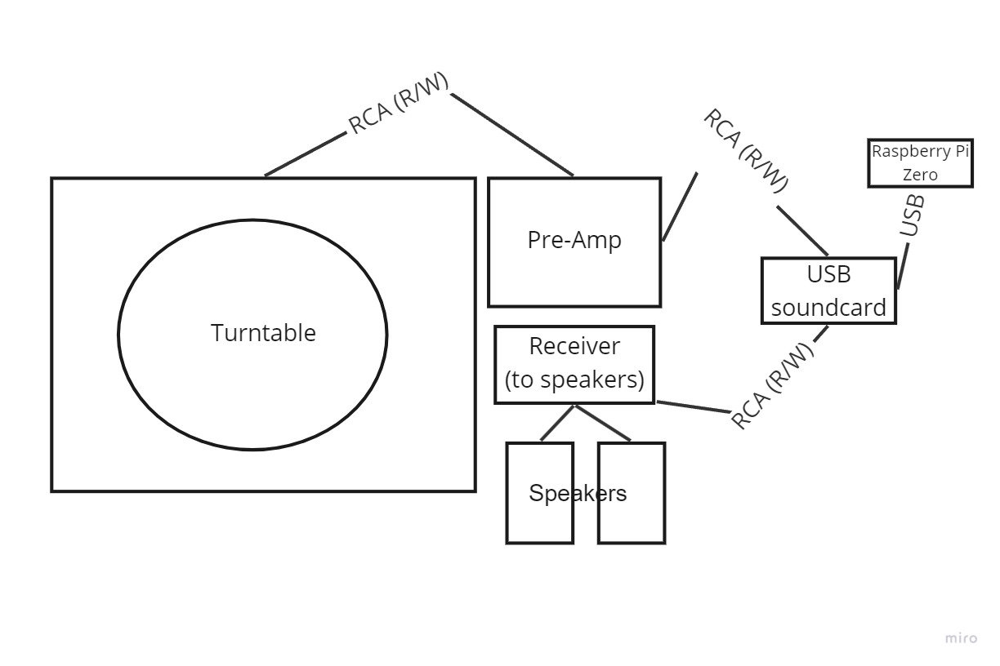

# Record Pi 3.0 (once more with feeling)

The third try at trying to identify the songs I am listening to on my record player. 

## Background

This idea has had many iterations, but this is the 2022 version, this time with more knowledge. 

### Hardware: 

- [Pioneer PL-530](https://www.manualslib.com/manual/1047058/Pioneer-Pl-530.html#manual) Full Automatic Turntable
  - [ART DJPREII pre amp](https://www.amazon.com/ART-DJPREII-Phono-Preamplifier/dp/B000AJR482)
  - 
- Raspberry Pi Zero W
  - Raspbian OS
- Raspberry Pi 4
  - Raspbian OS
  - Any home server would do
- [Behringer UCA202](https://www.behringer.com/product.html?modelCode=P0484) usb sound card

#### Hardware Setup:

- Turntable RCA output to pre-amp
- Pre-Amp RCA output to Behringer
- Behringer RCA output to speaker reciever
- Behringer USB to Raspberry Pi Zero W usb (through mini usb dongle)




### Icecast Server Setup

On the Pi Zero, we first need to set up an icecast and darkice server and mount. Lets get some stuff set up. Update everything and install icecast2. Go through the config and keep it pointed at localhost. Set up passwords and accounts however you want.

```
sudo apt update -y && sudo apt upgrade -y
sudo apt install icecast2

```

It is probably a good idea to backup the initial icecast config, but you dont really need to edit it past the initial config.

```
sudo cp /etc/icecast2/icecast.xml /etc/icecast2/icecast.xml.backup
```

Use "aplay -l" to get a list of the devices on your system. The hw:X,Y comes from this mapping of your hardware -- in this case, X is the card number, while Y is the device number. If you've only got the usb card plugged in you are likely going to be working with hw:1,0.


Install darkice and set up the config and the service. Darkice is the software that is recording from the USB device and encoding that into MP3. To configure it, create or edit the file /etc/darkice.cfg, and put this in:

```
sudo apt-get install darkice
sudo nano /etc/darkice.cfg
```

```
[general]
duration        = 0             # 0 = forever
bufferSecs      = 1             # buffer in seconds
reconnect       = yes
realtime        = yes

[input]
device          = hw:1,0    # Soundcard device for the audio input
sampleRate      = 44100         # 44.1 kHz sample rate
bitsPerSample   = 16            # 16 bits
channel         = 2             # 2 = stereo

[icecast2-0]
bitrateMode     = cbr           # cbr = constant bit rate
format          = mp3
bitrate         = 320           # bitrate
server          = localhost
port            = 8000          # port of the Icecast2 server
password        = hackme        # password for the Icecast2 server
mountPoint      = turntable.mp3 # mount point on the Icecast2 server
name            = Turntable
description     = Turntable Audio Stream via USB

```


Auto Start the services

Start the Icecast2 service and enable autostart:

```
sudo systemctl enable icecast2.service
sudo service icecast2 start
```

create the file `/etc/systemd/system/darkice1.service`

```
[Unit]
Description=DarkIce audio streamer
After=network.target

[Service]
ExecStart=/usr/bin/darkice -c /etc/darkice.cfg
StandardOutput=inherit
StandardError=inherit
Restart=always

[Install]
WantedBy=multi-user.target
```


Start the DarkIce service and enable autostart:

```
sudo systemctl enable darkice1.service
sudo service darkice1 status
```


Check the Icecast2 server status by visiting http://192.168.1.33:8000 in your browser.

You can listen to the actual audio stream at http://192.168.1.33:8000/turntable.mp3 in your browser. You should be able to hear the music of your turntable.


This is only half of this project though. Now that we can listen to our records from this server, we want to do something with the audio.


### Grabbing and Identifying the Audio

We can leave the Pi Zero now as it isnt that powerful and should probably only be doing one thing.

You do the rest from any home server of your choice, but I'm on a raspberry pi 4 home server. 

From this server, we first want to use fIcy to grab a recording of the icecast server

```
sudo fIcy -s .mp3 -o {recordingFile} -M 10 -d {host} {port} {mount}
```

I have simplified this down to `record.py` for ease of use. Be sure to create the `/recordings/` directory or change it to one that exists.

Now we have a 10 second recording of our stream at `/recordings/turntable.mp3` to give to the [AudD.io API ](https://audd.io/).

First, save your api token to `.env` as `API_TOKEN` so you dont need to hardcode it.

I have combined the API call and the record.py functionality into a single script called `tinyMansell.py`. This will record 10 seconds of audio from the stream, upload to the API and print the song, artist, and album, while outputting the raw json to `data.json`.

Futhermore, I have extended this into a docker container for even simpler use. Just change into the `docker` directory and run 

```
docker build --tag recordpi .
```

Once built, you can run it with the following command, or just run the `docker_run.sh` file which will do everything for you all at once.

One last thing I added was to add a volume on the above docker container that is created so that the data.json file written in the end is written to a path where an apache server is serving. This is more of just a proof of concept of a super simple "API" for this service..